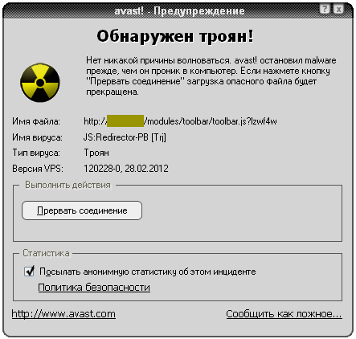
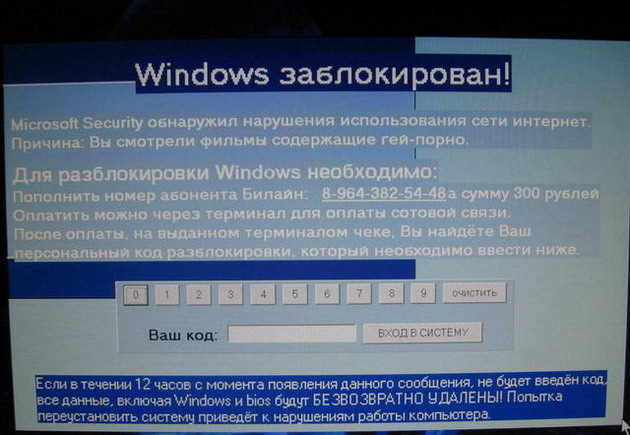

---
## Front matter
lang: ru-RU
title: Вредоносные программы. Троянские программы
subtitle: Основы информационной безопасности
author:
  - Пинега Б.А.
institute:
  - Российский университет дружбы народов, Москва, Россия

## i18n babel
babel-lang: russian
babel-otherlangs: english

## Formatting pdf
toc: false
toc-title: Содержание
slide_level: 2
aspectratio: 169
section-titles: true
theme: metropolis
header-includes:
 - \metroset{progressbar=frametitle,sectionpage=progressbar,numbering=fraction}
 - '\makeatletter'
 - '\beamer@ignorenonframefalse'
 - '\makeatother'
---

## Докладчик

  * Пинега Белла Александровна
  * Студентка НБИбд-02-22
  * Российский университет дружбы народов
  
## Определение вредоносных программ
Вредоносные программы - специально разработанные для нанесения вреда компьютерной системе, устройству или пользователям. Они могут включать в себя различные типы вредоносных кодов, такие как вирусы, черви, троянские кони, шпионские программы и рекламное ПО. 

## Зачем создаются троянские программы
- кража личной информации
- удаленное управление компьютером
- вымогательство
- распространение других вредоносных программ
- шпионаж и слежка

## Основные виды вредоносных программ
Вирусы
Черви
Троянские программы
{#fig:001 width=40%}

## Троянские программы 
это вредоносные программы, которые скрываются под обычными или полезными программами, чтобы получить доступ к компьютеру и выполнить определенные действия без согласия пользователя. 
{#fig:004 width=30%}

## Троянские программы:
1. Backdoor
2. Donald Dick
3. Crack2000
4. Extacis
5. KillCMOS and Netbus

## Опасность троянских программ
1. Угроза безопасности данных
2. Подрыв стабильности системы
3. Отслеживание действий пользователя
{#fig:002 width=35%}
{#fig:003 width=35%}

## Как защититься от троянских программ?
- установка антивируса
- обновление ОС и всех установленных программ
- бережное отношение к интернет-ресурсам
{#fig:004 width=50%}

