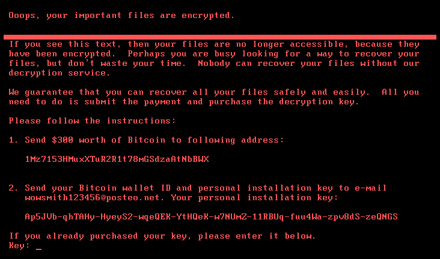

## Front matter
title: "Вредоносные программы. Троянские программы"
subtitle: "Основы информационной безопасности"
author: "Пинега Белла Александровна"

## Generic otions
lang: ru-RU
toc-title: "Содержание"

## Bibliography
bibliography: bib/cite.bib
csl: pandoc/csl/gost-r-7-0-5-2008-numeric.csl

## Pdf output format
toc: true # Table of contents
toc-depth: 2
lof: true # List of figures
lot: true # List of tables
fontsize: 12pt
linestretch: 1.5
papersize: a4
documentclass: scrreprt
## I18n polyglossia
polyglossia-lang:
  name: russian
  options:
	- spelling=modern
	- babelshorthands=true
polyglossia-otherlangs:
  name: english
## I18n babel
babel-lang: russian
babel-otherlangs: english
## Fonts
mainfont: PT Serif
romanfont: PT Serif
sansfont: PT Sans
monofont: PT Mono
mainfontoptions: Ligatures=TeX
romanfontoptions: Ligatures=TeX
sansfontoptions: Ligatures=TeX,Scale=MatchLowercase
monofontoptions: Scale=MatchLowercase,Scale=0.9
## Biblatex
biblatex: true
biblio-style: "gost-numeric"
biblatexoptions:
  - parentracker=true
  - backend=biber
  - hyperref=auto
  - language=auto
  - autolang=other*
  - citestyle=gost-numeric
## Pandoc-crossref LaTeX customization
figureTitle: "Рис."
tableTitle: "Таблица"
listingTitle: "Листинг"
lofTitle: "Список иллюстраций"
lotTitle: "Список таблиц"
lolTitle: "Листинги"
## Misc options
indent: true
header-includes:
  - \usepackage{indentfirst}
  - \usepackage{float} # keep figures where there are in the text
  - \floatplacement{figure}{H} # keep figures where there are in the text
---

## Введение
В современном мире вредоносные программы, в том числе троянские программы, становятся все более распространенным и опасным видом киберугроз. Они могут незаметно проникать в компьютерные системы, украден а ручат доступ к личной информации, банковским данным, паролям и другим ценным данным пользователя.
Данный доклад посвящен теме вредоносных программ, в частности троянских программ. В нем будет рассмотрено определение троянских программ, основные характеристики и принципы их работы, методы распространения, последствия использования, а также меры защиты от таких программ.
Целью данного доклада является повышение осведомленности пользователей о рисках, связанных с троянскими программами, и предоставление практических рекомендаций по обеспечению безопасности в сети. Понимание угроз и принятие соответствующих мер по защите поможет предотвратить негативные последствия атак с использованием троянских программ и обеспечить сохранность ваших данных.

# Определение вредоносных программ
Вредоносные программы, также известные как зловредное программное обеспечение, представляют собой программы, специально разработанные для нанесения вреда компьютерной системе, устройству или пользователям. Они могут включать в себя различные типы вредоносных кодов, такие как вирусы, черви, троянские кони, шпионские программы и рекламное ПО. Мы с вами рассмотрим в частности троянские программы.
Целью вредоносных программ может быть получение конфиденциальной информации, нанесение финансового ущерба, нарушение работы системы или просто вызывание хаоса. Вредоносные программы могут распространяться через зараженные веб-сайты, электронную почту, съемные носители данных или другие способы.
Для защиты от вредоносных программ используются антивирусные программы, брандмауэры и другие средства безопасности. Однако разработчики вредоносного ПО постоянно совершенствуют свои методы, поэтому важно поддерживать свои системы обновленными и быть бдительными при работе с интернетом.

# Зачем создаются троянские программы
Создание троянских программ является одним из наиболее распространенных видов киберпреступности в современном мире. Рассмотрим пять основных причин, по которым злоумышленники могут создавать троянские программы.
Одной из основных целей создания троянских программ является кража личных данных пользователей, таких как пароли, номера кредитных карт, личная корреспонденция и другие конфиденциальные сведения. Эти данные могут быть использованы для вымогательства, мошенничества или продажи на черном рынке.
Помимо этого злоумышленники могут создавать троянские программы для получения удаленного доступа к зараженному компьютеру. Это позволяет им выполнять различные действия без ведома пользователя, такие как установка других вредоносных программ, шпионаж за активностью пользователя и использование компьютера в качестве ботнета для совершения кибератак.
Из первых двух причин вытекает третья: троянские программы могут быть использованы для шифрования файлов на компьютере пользователя и требования выкупа за их расшифровку. Этот вид атаки называется рэнсомваром и может принести злоумышленникам значительную прибыль за счет вымогательства денег у жертв.
Часто троянские программы используются для распространения других видов вредоносного ПО, таких как шпионские программы, рекламное ПО или ранее упомянутые ботнеты. Это помогает злоумышленникам увеличить свою армию зараженных устройств и увеличить свою кибермощь.

В целом, создание троянских программ обусловлено желанием злоумышленников получить незаконную прибыль, контроль над компьютерами пользователей или доступ к конфиденциальной информации. Важно оценивать риски, связанные с такими видами киберугроз, и принимать меры по обеспечению безопасности своих систем.
И целью моего доклада будет не только рассмотреть вредоносные программы в целом, но и детально познакомиться с троянскими программами и способами защиты от них.

## Основные виды вредоносных программ
# Вирусы
В наше время виртуальная среда стала неотъемлемой частью повседневной жизни, но при этом она стала источником различных угроз для безопасности компьютеров и данных пользователей. Вредоносные программы, также известные как вирусы, являются одним из основных видов киберугроз, способных нанести серьезный вред компьютерам и информации.

Вредоносные программы, или вирусы, представляют собой программное обеспечение, созданное с целью нанесения вреда компьютерам или украдения конфиденциальной информации. Они могут быть разработаны для различных целей, таких как кража личных данных, удаленное управление компьютером, шифрование файлов или распространение других видов вредоносного ПО.
Вирусы могут распространяться через электронные письма, содержащие вложения или ссылки на зараженные файлы. Злоумышленники могут размещать вредоносные программы на веб-сайтах или использовать рекламу для распространения вирусов. Вирусы могут быть переданы через зараженные USB-устройства, такие как флеш-накопители или внешние жесткие диски. Вредоносные программы могут быть распространены через файлообменные сети, где пользователи могут загружать файлы без должной проверки на наличие вирусов.
Какой вред могут нанести компьютеру вредоносные программы?
Вирусы могут стереть или зашифровать данные на компьютере пользователя, что приведет к потере ценной информации. Некоторые вирусы могут замедлить работу компьютера или вызвать сбои в его функционировании. Вредоносные программы могут украсть личные данные пользователя, такие как пароли, номера кредитных карт и другие конфиденциальные сведения.
Некоторые вирусы могут предоставить злоумышленникам удаленный доступ к компьютеру пользователя, что позволит им контролировать устройство и выполнить различные действия без согласия пользователя.
Несложно понять, что вирусы представляют серьезную угрозу для безопасности компьютеров и данных пользователей, но это далеко не единственный вид вредоносной программы.

# Черви
Следующим из видов вредоносного ПО являются черви, которые отличаются своими особенностями и способами заражения. 
Вредоносные программы-черви (worms) представляют собой автономные программы, способные распространяться по сети компьютеров без необходимости вмешательства пользователя. Они отличаются от вирусов тем, что не требуют зараженного файла или хост-программы для своего распространения.
Принцип работы вредоносных программ-червей заключается в том, что они используют уязвимости в сетевых протоколах или операционных системах для распространения самих себя. Червь может сканировать сеть в поисках уязвимых узлов и автоматически копировать себя на другие компьютеры через сеть.
{#fig:001 width=60%}
Пути заражения вредоносными программами-червями:
1. Электронная почта: Черви могут распространяться через электронные письма, содержащие вредоносные вложения или ссылки на зараженные сайты.
2. Сетевые уязвимости: Черви могут использовать уязвимости в сетевых протоколах или операционных системах для автоматического распространения по сети.
3. Устройства USB: Вредоносные черви могут распространяться через зараженные USB-устройства, такие как флеш-накопители.
4. Инфицированные файлы: Черви могут быть встроены в файлы, которые пользователь загружает из интернета или получает по электронной почте.

Чтобы защититься от вредоносных программ-червей необходимо регулярное обновление и использование антивирусных программ, которое поможет обнаружить и удалить вредоносные черви. Установка всех доступных обновлений поможет закрыть уязвимости, которые могут быть использованы червями для распространения.
Помимо этого не следует открывать вложения из ненадежных источников и загружать файлы с подозрительных сайтов и тогда проблем у вас не возникнет.

# Троянские программы
Вредоносные программы, такие как троянские кони, представляют серьезную угрозу для безопасности компьютерных систем и данных. Троянский конь - это программа, которая предоставляет посторонним доступ к компьютеру для выполнения действий без ведома владельца компьютера или для отправки собранной информации на определенный адрес. В данном докладе мы рассмотрим, что такое троянские программы, их пути проникновения и примеры использования.
Троянские программы (Trojans) - это вредоносные программы, которые скрываются под обычными или полезными программами, чтобы получить доступ к компьютеру и выполнить определенные действия без согласия пользователя. В отличие от вирусов, трояны чаще всего направлены на кражу конфиденциальной информации или обеспечение удаленного доступа к компьютеру.
Попасть такие программы могут самыми разными способами. Трояны могут скрываться под видом полезных программ или утилит, чтобы пользователь случайно запустил их.
Запуск зараженных программ, загруженных с ненадежных сайтов или из электронных писем, может привести к заражению компьютера троянскими программами.
лоумышленники могут установить трояна на компьютер при наличии физического доступа к нему, например, через USB-устройства.
Предлагаю выделить несколько троянсих программ:
1. Backdoor: Этот тип троянского коня открывает "заднюю дверь" в систему, обеспечивая злоумышленнику удаленный доступ к компьютеру.
2. Donald Dick: Троян, который может удалять файлы с компьютера или изменять системные настройки.
3. Crack2000: Троян, используемый для обхода защиты лицензий программного обеспечения.
4. Extacis: Троян, который шифрует файлы на компьютере и требует выкуп для их разблокировки.
5. KillCMOS and Netbus: Трояны, используемые для удаленного управления компьютером или вызова различных проблем с системой.

## Опасность троянских программ

# Угроза безопасности данных
В целом, троянские программы представляют серьезную угрозу для безопасности данных пользователей, одной из основных угроз, связанных с троянскими программами, является возможность кражи конфиденциальной информации пользователя. Трояны могут собирать данные о банковских счетах, паролях, личной переписке и других чувствительных данных, которые могут быть использованы злоумышленниками для мошенничества или вымогательства. 
Некоторые троянские программы предоставляют злоумышленникам удаленный доступ к компьютеру пользователя. Это означает, что злоумышленники могут просматривать файлы, устанавливать дополнительное вредоносное ПО, изменять настройки системы и даже удалять данные без ведома владельца компьютера. Помимо этого троянские программы могут зашифровать данные на компьютере пользователя и требовать выкуп за их разблокировку. Этот тип атаки называется "вымогательство данных" и может привести к серьезным финансовым потерям и потере ценной информации.
{#fig:002 width=50%}
Троянские программы также способны повредить файлы на компьютере или изменить системные настройки, что может привести к неполадкам в работе операционной системы и программного обеспечения.
Злоумышленники могут использовать зараженные компьютеры для отправки спама, распространения вирусов и других вредоносных программ, что не только создает проблемы для жертв, но и способствует распространению вредоносного ПО по всему Интернету.
Для защиты от таких угроз необходимо принимать меры по обеспечению безопасности компьютера, о которых мы поговорим далее.

# Подрыв стабильности системы
Как мы уже убедились троянские программы представляют серьезную угрозу для стабильности системы, поскольку они обладают способностью скрытно внедряться в компьютер и выполнять различные вредоносные действия без ведома пользователя. Но как они могут подорвать стабильность системы?
Во-первых, троянские программы могут воровать личные данные пользователя, такие как пароли, банковские данные, личная информация. Это может привести к утечке конфиденциальных данных и угрозе безопасности.
Во-вторых, троянские программы могут выполнять действия, которые могут привести к сбою в работе системы, например, блокировка доступа к файлам и программам, перенаправление на вредоносные сайты и другие подобные воздействия.
Также троянские программы могут удалять, изменять или повреждать файлы и программы на компьютере. Это может привести к потере важных данных и нарушению работы системы.
Они могут использовать ресурсы компьютера для своих злонамеренных целей, что может привести к снижению производительности системы и увеличению времени отклика.
И ещё троянские программы могут служить как входные ворота для других вредоносных программ, таких как вирусы, черви и шпионские программы. Это может увеличить уровень угроз для системы.

# Отслеживание действий пользователя
Для отслеживания действий пользователя при наличии троянской программы, злоумышленники могут использовать различные методы и технологии. Один из самых распространенных способов отслеживания действий пользователя - использование кейлоггеров. 
{#fig:003 width=60%}
Кейлоггеры записывают все нажатия клавиш на клавиатуре, что позволяет злоумышленникам получить доступ к паролям, личной информации, текстовым сообщениям, электронной почте и другим данным, которые пользователь вводит с помощью клавиатуры.
Троянские программы могут мониторить активность пользователя на компьютере, записывать скриншоты экрана, отслеживать посещенные веб-сайты, активность в социальных сетях, переписку и другие действия. Это позволяет злоумышленникам узнать о привычках пользователя, его интересах и даже получить доступ к личной информации.
Нельзя не упомянуть, что трояны могут иметь доступ к файлам и папкам на компьютере пользователя, что позволяет злоумышленникам копировать, изменять, удалять или передавать файлы по своему усмотрению.
Некоторые троянские программы могут быть способны к удаленному управлению компьютером пользователя. Это позволяет злоумышленникам выполнять действия на компьютере пользователя без его ведома, такие как запуск приложений, скачивание файлов, перезагрузка системы и другие операции.
Они могут собирать различную информацию о пользователе, такую как пароли, банковские данные, личные данные, и передавать ее злоумышленникам через интернет.
И в целом, троянские программы могут использовать различные методы для отслеживания действий пользователя на компьютере и получения доступа к его личной информации. Как же защитить свой компьютер от троянских программ? Предлагаю разобраться. 

## Как защититься от троянских программ?
Во-первых, одной из основных мер защиты является использование надежного антивирусного программного обеспечения. Антивирус поможет обнаруживать и удалять троянские программы, предотвращая их воздействие на компьютер. Важно регулярно обновлять базы данных антивируса, чтобы обеспечить защиту от новых угроз.
{#fig:004 width=60%}
Во-вторых, необходимо регулярно обновлять операционную систему и все установленные программы. Обновления содержат исправления уязвимостей, которые могут быть использованы злоумышленниками для распространения троянских программ. Поэтому важно следить за выходом новых версий и устанавливать обновления немедленно.
Третьим важным аспектом является бережное отношение к интернет-ресурсам. Не следует открывать подозрительные вложения в электронных письмах, скачивать файлы с недоверенных сайтов или кликать на подозрительные ссылки. Такие действия могут привести к заражению вашего компьютера троянскими программами.
Кроме того, рекомендуется использовать брандмауэр для контроля сетевого трафика и предотвращения несанкционированного доступа к компьютеру. Брандмауэр поможет блокировать попытки вторжения и защитит вашу систему от вредоносных программ.
В целом, соблюдение этих мер поможет уменьшить риск заражения компьютера троянскими программами и обеспечит более надежную защиту данных и конфиденциальности. Важно помнить о необходимости постоянного обновления и поддержания безопасности компьютерной системы для минимизации угроз и обеспечения безопасности данных.

## Примеры из практики
Исследование знаменитых случаев атак троянскими программами позволяет выявить уязвимости в системах безопасности и извлечь уроки для улучшения защиты от подобных атак. Ниже приведу наиболее известные случаев атак троянскими программами и их уроки:
1. Stuxnet: В 2010 году было обнаружено вирусное ПО Stuxnet, которое направлено на кибер-атаку на ядерные объекты Ирана. Урок: данное событие показало, что даже высоко защищенные объекты могут быть подвержены атакам троянских программ, поэтому необходимо постоянно обновлять системы безопасности и мониторинга.
2. Zeus: Zeus – это троян, который был использован для кражи банковских данных и финансовых средств. Урок: важно обеспечить защиту банковских данных и финансовых транзакций, используя многоуровневую защиту и механизмы аутентификации.
3. NotPetya: В 2017 году вирус NotPetya атаковал компьютерные системы в различных странах, причинив значительный ущерб. Урок: важно иметь план восстановления после атаки и регулярно создавать резервные копии данных для минимизации потерь.
4. Mirai: Mirai – это ботнет, созданный для организации DDoS-атак на крупные интернет-сервисы. Урок: важно защищать свои устройства от заражения ботнетами путем использования надежных паролей и обновлений ПО.
5. Emotet: Emotet – это троян, который используется для распространения других вредоносных программ, таких как рэнсомвары и шпионское ПО. Урок: важно обучать пользователей распознавать подозрительные электронные сообщения и ссылки, чтобы предотвратить заражение компьютеров.
Из вышеперечисленных случаев атак троянскими программами можно извлечь следующие уроки: постоянно обновлять системы безопасности, использовать многоуровневую защиту, иметь план восстановления после атаки, обучать пользователей безопасности в интернете и регулярно создавать резервные копии данных. Эти меры помогут уменьшить риск заражения компьютеров троянскими программами и обеспечат более надежную защиту от киберугроз.

## Заключение
Вредоносные программы, в частности троянские программы, представляют серьезную угрозу для безопасности компьютерных систем и личной информации пользователей. Они могут вызывать значительные финансовые потери, угрожать конфиденциальности данных и наносить вред репутации компаний и частных лиц. Поэтому защита от таких угроз играет ключевую роль для обеспечения безопасности в сети.
Антивирусное и антишпионское программное обеспечение, регулярное обновление программ, осторожность при работе в интернете - это основные меры, направленные на защиту от троянских программ. Кроме того, важно быть информированным о последних угрозах и учитывать опыт известных случаев атак с использованием троянских программ.
Для общества в целом и для каждого отдельного пользователя важно осознавать риски, связанные с использованием интернета, и принимать меры по защите от вредоносных программ, чтобы сохранить свою конфиденциальность и безопасность данных.

Именно соблюдение основных принципов безопасности в сети поможет предотвратить угрозы и минимизировать риски, связанные с троянскими программами. Соблюдение рекомендаций и использование современных технологий защиты станут гарантией безопасности вашей информации и сохранности ваших данных.

##  Список литературы
1. https://ru.wikipedia.org/wiki/%D0%A2%D1%80%D0%BE%D1%8F%D0%BD%D1%81%D0%BA%D0%B0%D1%8F_%D0%BF%D1%80%D0%BE%D0%B3%D1%80%D0%B0%D0%BC%D0%BC%D0%B0
2. "Вредоосные программы в компьютерных сетях " Ю.М.Монахов, Л.М.Груздева, М.Ю.Монахов
3. http://a-vir.chalna.edusite.ru/p4aa1.html
4."Анализ вредоносных программ" К.А.Монаппа
5. "Выявление вредоносных программ" А.И.Кучеров
::: {#refs}
:::
