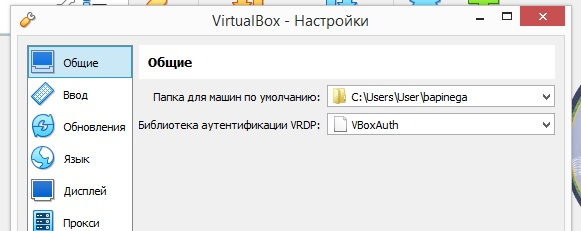
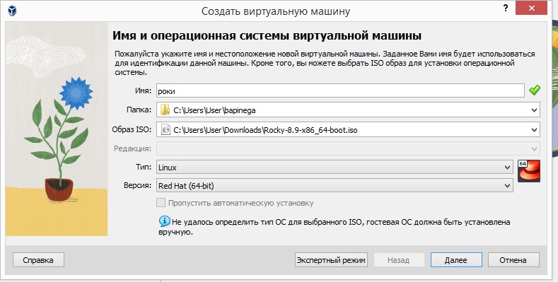
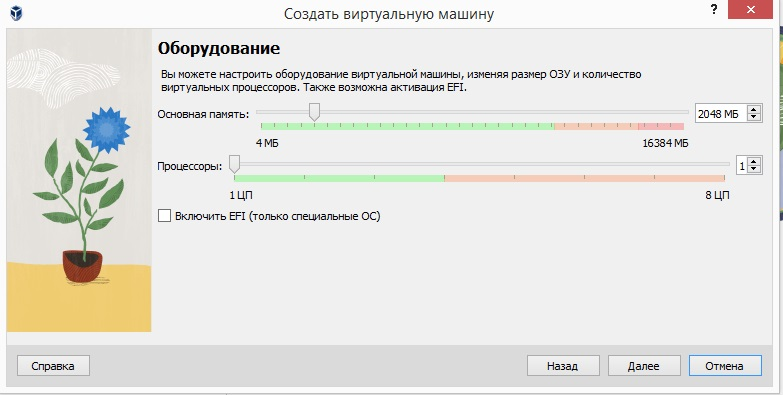
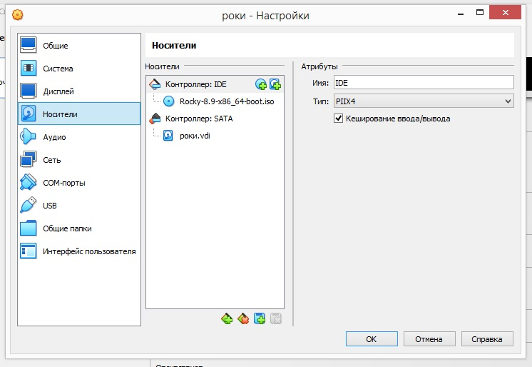
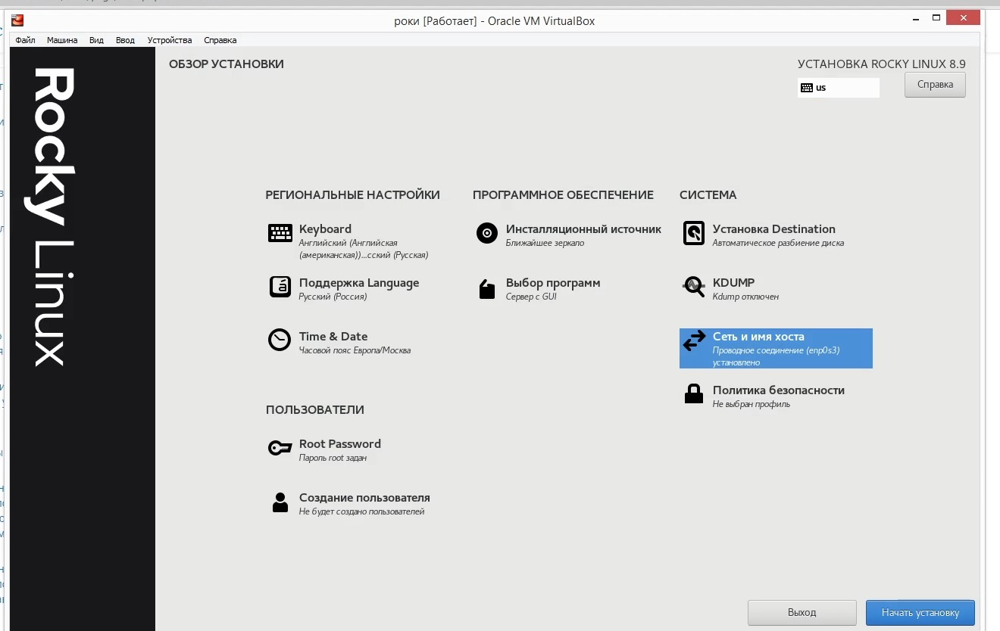
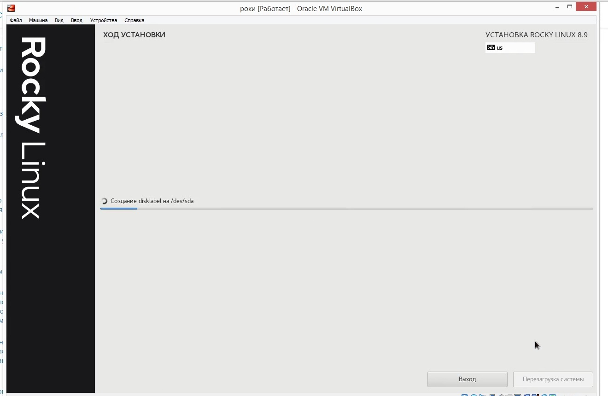

---
## Front matter
lang: ru-RU
title: Лабораторная работа 1
subtitle: Основы информационной безопасности
author:
  - Пинега Б.А.
institute:
  - Российский университет дружбы народов, Москва, Россия

## i18n babel
babel-lang: russian
babel-otherlangs: english

## Formatting pdf
toc: false
toc-title: Содержание
slide_level: 2
aspectratio: 169
section-titles: true
theme: metropolis
header-includes:
 - \metroset{progressbar=frametitle,sectionpage=progressbar,numbering=fraction}
 - '\makeatletter'
 - '\beamer@ignorenonframefalse'
 - '\makeatother'
---

# Информация

## Докладчик

:::::::::::::: {.columns align=center}
::: {.column width="70%"}

  * Пинега Белла Александровна
  * Студентка НБИбд-02-22
  * Российский университет дружбы народов

:::
::::::::::::::

## Выполнение лабораторной работы
Согласуем название с логином 
{#fig:001 width=70%}
## Создам виртуальную машину 
{#fig:002 width=70%}
## Укажу размер основной памяти
{#fig:003 width=70%}
## Добавлю новый оптический привод
{#fig:004 width=70%}
## Запуск ВМ и настройка
{#fig:006 width=70%}
## Устанавливаю ОС.
{#fig:007 width=70%}

## Вывод

ОС успешно установлена. Я приобрела практические навыки установки операционной системы на виртуальную машину, настройки минимально необходимых для дальнейшей работы сервисов.

::: 

