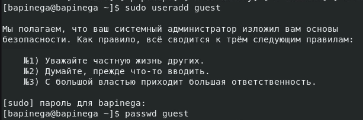
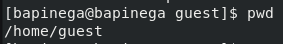
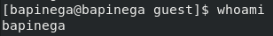
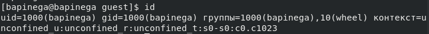
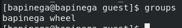
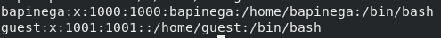
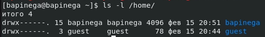
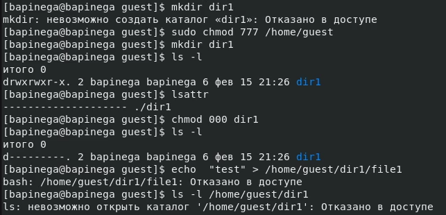
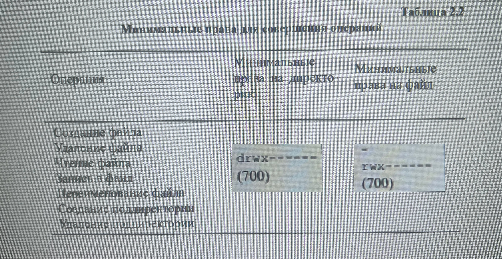

---
## Front matter
lang: ru-RU
title: Лабораторная работа 2
subtitle: Основы информационной безопасности
author:
  - Пинега Б.А.
institute:
  - Российский университет дружбы народов, Москва, Россия

## i18n babel
babel-lang: russian
babel-otherlangs: english

## Formatting pdf
toc: false
toc-title: Содержание
slide_level: 2
aspectratio: 169
section-titles: true
theme: metropolis
header-includes:
 - \metroset{progressbar=frametitle,sectionpage=progressbar,numbering=fraction}
 - '\makeatletter'
 - '\beamer@ignorenonframefalse'
 - '\makeatother'
---

## Докладчик

  * Пинега Белла Александровна
  * Студентка НБИбд-02-22
  * Российский университет дружбы народов

:::
::::::::::::::

## создам учётную запись пользователя guest 
{#fig:001 width=40%}

## Войду в систему от имени пользователя guest и увижу где я нахожусь
{#fig:002 width=40%}
Я нахожусь не в домашней директории

## имя моего пользователя 
{#fig:003 width=40%}

## сравним
{#fig:004 width=25%}
{#fig:005 width=25%}

## просмотрю файл /etc/passwd
{#fig:006 width=70%}
Можно заметить что значения совпадают с значениями с фото 4

## список поддиректорий директории /home и их права
{#fig:007 width=70%}

## права dir1 
создам файл file1, тк я сняла с директории все атрибуты я получаю отказ.
{#fig:008 width=70%}

## таблица
{#fig:009 width=70%}

## Выводы
Я приобрела практические навыки работы в консоли с атрибутами файлов, закрепление теоретических основ дискреционного разграничения доступа в современных системах с открытым кодом на базе ОС Linuх.
