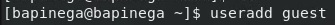
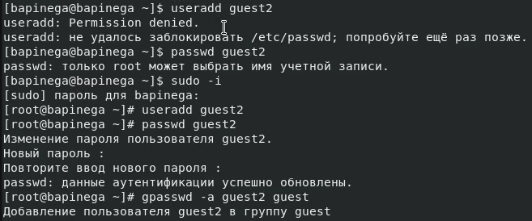
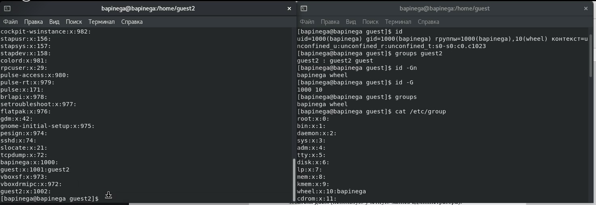
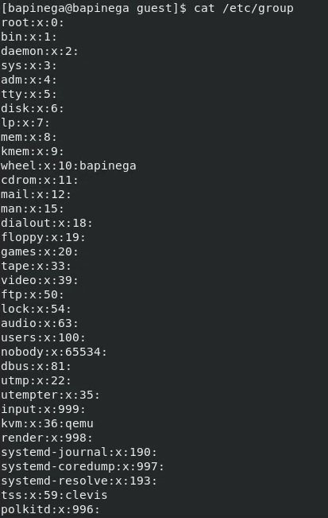
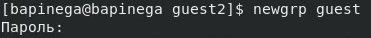
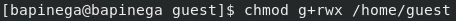
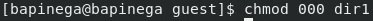
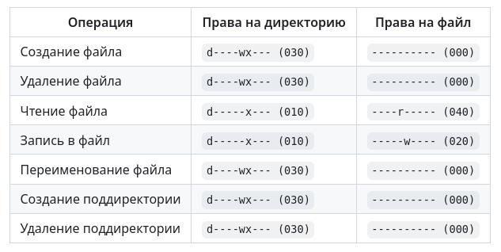
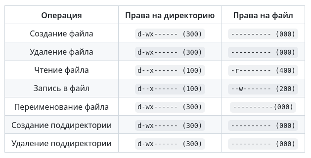

---
## Front matter
lang: ru-RU
title: Лабораторная работа 3
subtitle: Основы информационной безопасности
author:
  - Пинега Б.А.
institute:
  - Российский университет дружбы народов, Москва, Россия

## i18n babel
babel-lang: russian
babel-otherlangs: english

## Formatting pdf
toc: false
toc-title: Содержание
slide_level: 2
aspectratio: 169
section-titles: true
theme: metropolis
header-includes:
 - \metroset{progressbar=frametitle,sectionpage=progressbar,numbering=fraction}
 - '\makeatletter'
 - '\beamer@ignorenonframefalse'
 - '\makeatother'
---

## Докладчик

  * Пинега Белла Александровна
  * Студентка НБИбд-02-22
  * Российский университет дружбы народов

:::
::::::::::::::

## Выполнение лабораторной работы
{#fig:001 width=45%}
{#fig:002 width=45%}

## имя пользователя, группу 
{#fig:003 width=50%}

## Просмотрю файл  /etc/group 
{#fig:004 width=40%}
{#fig:005 width=40%}

## регистрация пользователя guest2 в группе guest 
{#fig:006 width=50%}

## разрешу все действия для пользователей группы
{#fig:007 width=60%}

## сниму с директории /home/guest/dir1 все атрибуты командой
{#fig:008 width=60%}

## таблица
{#fig:009 width=45%}
{#fig:010 width=45%}
::::::::::::::
## Вывод
Я научилась работать в консоли с атрибутами файлов для групп пользователей1.

::: 
