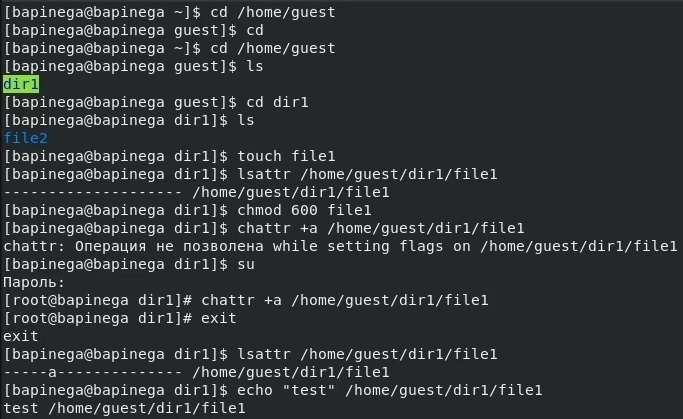
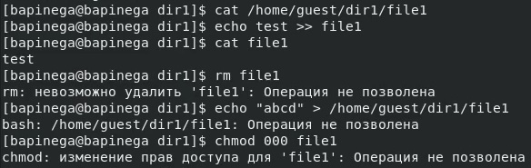
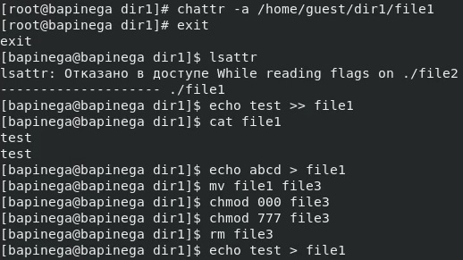
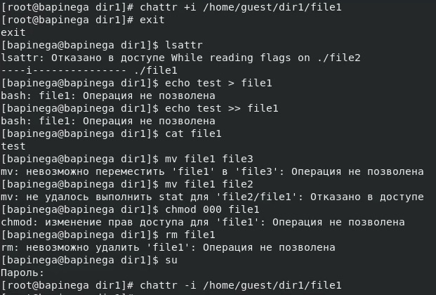

---
## Front matter
lang: ru-RU
title: Лабораторная работа 4
subtitle: Основы информационной безопасности
author:
  - Пинега Б.А.
institute:
  - Российский университет дружбы народов, Москва, Россия

## i18n babel
babel-lang: russian
babel-otherlangs: english

## Formatting pdf
toc: false
toc-title: Содержание
slide_level: 2
aspectratio: 169
section-titles: true
theme: metropolis
header-includes:
 - \metroset{progressbar=frametitle,sectionpage=progressbar,numbering=fraction}
 - '\makeatletter'
 - '\beamer@ignorenonframefalse'
 - '\makeatother'
---

## Докладчик

  * Пинега Белла Александровна
  * Студентка НБИбд-02-22
  * Российский университет дружбы народов

## Цель работы
Получение практических навыков работы в консоли с расширенными
атрибутами файлов

## Выполнение лабораторной работы
{#fig:001 width=50%}

## Выполню чтение файла file1 
{#fig:002 width=70%}

## Сниму расширенный атрибут a 
Повторю операции
{#fig:003 width=50%}

## Заменив атрибут «a» атрибутом «i».
{#fig:004 width=70%}

## Выводы

В результате выполнения работы я повысила навыки использования интерфейса командой строки (CLI), познакомились на примерах с тем, как используются основные и расширенные атрибуты при разграничении доступа. Имели возможность связать теорию дискреционного разделения доступа (дискреционная политика безопасности) с её реализацией на практике в ОС Linux. Составили наглядные таблицы, поясняющие какие операции возможны при тех или иных установленных правах. Опробовали действие на практике расширенных атрибутов «а» и «i»

