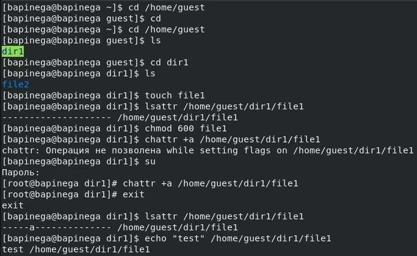
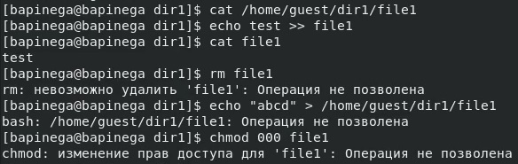
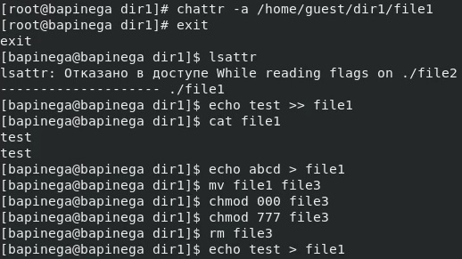
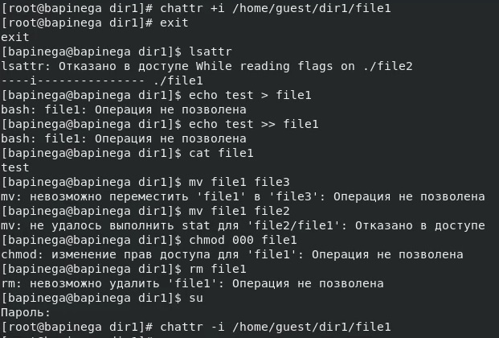

## Front matter
title: "Лабораторная работа №4"
subtitle: "Основы информационной безопасности"
author: "Пинега Белла Александровна"

## Generic otions
lang: ru-RU
toc-title: "Содержание"

## Bibliography
bibliography: bib/cite.bib
csl: pandoc/csl/gost-r-7-0-5-2008-numeric.csl

## Pdf output format
toc: true # Table of contents
toc-depth: 2
lof: true # List of figures
lot: true # List of tables
fontsize: 12pt
linestretch: 1.5
papersize: a4
documentclass: scrreprt
## I18n polyglossia
polyglossia-lang:
  name: russian
  options:
	- spelling=modern
	- babelshorthands=true
polyglossia-otherlangs:
  name: english
## I18n babel
babel-lang: russian
babel-otherlangs: english
## Fonts
mainfont: PT Serif
romanfont: PT Serif
sansfont: PT Sans
monofont: PT Mono
mainfontoptions: Ligatures=TeX
romanfontoptions: Ligatures=TeX
sansfontoptions: Ligatures=TeX,Scale=MatchLowercase
monofontoptions: Scale=MatchLowercase,Scale=0.9
## Biblatex
biblatex: true
biblio-style: "gost-numeric"
biblatexoptions:
  - parentracker=true
  - backend=biber
  - hyperref=auto
  - language=auto
  - autolang=other*
  - citestyle=gost-numeric
## Pandoc-crossref LaTeX customization
figureTitle: "Рис."
tableTitle: "Таблица"
listingTitle: "Листинг"
lofTitle: "Список иллюстраций"
lotTitle: "Список таблиц"
lolTitle: "Листинги"
## Misc options
indent: true
header-includes:
  - \usepackage{indentfirst}
  - \usepackage{float} # keep figures where there are in the text
  - \floatplacement{figure}{H} # keep figures where there are in the text
---

# Цель работы

Получение практических навыков работы в консоли с расширенными
атрибутами файлов

# Задание

1. От имени пользователя guest определите расширенные атрибуты файла
/home/guest/dir1/file1 командой
lsattr /home/guest/dir1/file1
2. Установите командой
chmod 600 file1
на файл file1 права, разрешающие чтение и запись для владельца фай-
ла.
3. Попробуйте установить на файл /home/guest/dir1/file1 расширен-
ный атрибут a от имени пользователя guest:
chattr +a /home/guest/dir1/file1
В ответ вы должны получить отказ от выполнения операции.
4. Зайдите на третью консоль с правами администратора либо повысьте
свои права с помощью команды su. Попробуйте установить расширен-
ный атрибут a на файл /home/guest/dir1/file1 от имени суперполь-
зователя:
chattr +a /home/guest/dir1/file1
5. От пользователя guest проверьте правильность установления атрибута:
lsattr /home/guest/dir1/file1
6. Выполните дозапись в файл file1 слова «test» командой
echo "test" /home/guest/dir1/file1
После этого выполните чтение файла file1 командой
cat /home/guest/dir1/file1
Убедитесь, что слово test было успешно записано в file1.
7. Попробуйте удалить файл file1 либо стереть имеющуюся в нём инфор-
мацию командой
echo "abcd" > /home/guest/dirl/file1
Попробуйте переименовать файл.
8. Попробуйте с помощью команды

# Теоретическое введение

1.2.1. Техническое обеспечение
Лабораторная работа подразумевает установку на виртуальную машину
VirtualBox (https://www.virtualbox.org/) операционной системы Linux
(дистрибутив Rocky (https://rockylinux.org/)).
Выполнение работы возможно как в дисплейном классе факультета
физико-математических и естественных наук РУДН, так и дома. Описание
выполнения работы приведено для дисплейного класса со следующими ха-
рактеристиками:
– Intel Core i3-550 3.2 GHz, 4 GB оперативной памяти, 20 GB свободного
места на жёстком диске;
– ОС Linux Gentoo (http://www.gentoo.ru/);
– VirtualBox верс. 6.1 или старше;
– каталог с образами ОС для работающих в дисплейном классе:
/afs/dk.sci.pfu.edu.ru/common/files/iso/.
1.2.2. Соглашения об именовании
При выполнении работ следует придерживаться следующих правил име-
нования: имя виртуальной машины, имя хоста вашей виртуальной машины,
пользователь внутри виртуальной машины должны совпадать с логином
студента, выполняющего лабораторную работу. Вы можете посмотреть
ваш логин, набрав в терминале ОС типа Linux команду id -un.

# Выполнение лабораторной работы
1. Мы определили от имени пользователя guest расширенные атрибуты файла
/home/guest/dir1/file1 командой lsattr /home/guest/dir1/file1. 
Затем командой chmod 600 file1 установлю на файл file1 права, разрешающие чтение и запись для владельца файла. Установить на файл /home/guest/dir1/file1 расширенный атрибут a от имени пользователя guest я получаю отказ. 
С помощью команды su установлю атрибут a на файл /home/guest/dir1/file1 от имени суперпользователя:
chattr +a /home/guest/dir1/file1
Атрибут установлен. Выполню дозапись в файл file1 слова «test» 
{#fig:001 width=70%}
2. Выполню чтение файла file1 командой cat /home/guest/dir1/file1.
Слово test было успешно записано в file1.
Удалить файл file1 либо стереть имеющуюся в нём инфор-
мацию командой, а также переименовать файл не удалось.
С помощью команды chmod 000 file1 установлю на файл file1 запрещающие права.
Мне не удалось это сделать.
{#fig:002 width=70%}
3. Сниму расширенный атрибут a с файла /home/guest/dirl/file1.
Повторю операции
{#fig:003 width=70%}
4. Заменив атрибут «a» атрибутом «i».
Мне не удалось дозаписать информацию в файл
{#fig:004 width=70%}

# Выводы

В результате выполнения работы вы повысили свои навыки использова-
ния интерфейса командой строки (CLI), познакомились на примерах с тем,
как используются основные и расширенные атрибуты при разграничении
доступа. Имели возможность связать теорию дискреционного разделения
доступа (дискреционная политика безопасности) с её реализацией на прак-
тике в ОС Linux. Составили наглядные таблицы, поясняющие какие опера-
ции возможны при тех или иных установленных правах. Опробовали дей-
ствие на практике расширенных атрибутов «а» и «i»

# Список литературы{.unnumbered}

::: {#refs}
:::
