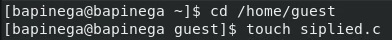
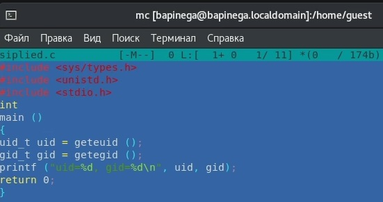
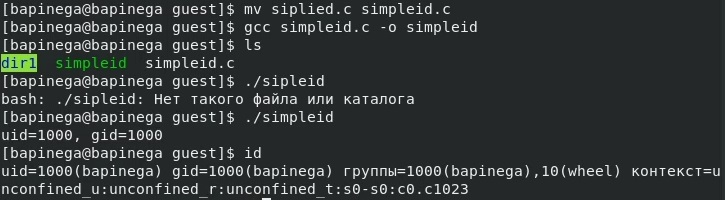
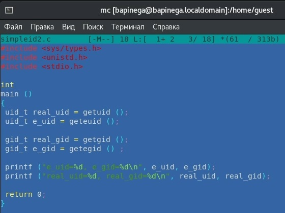
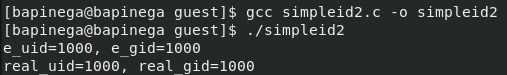
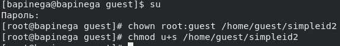
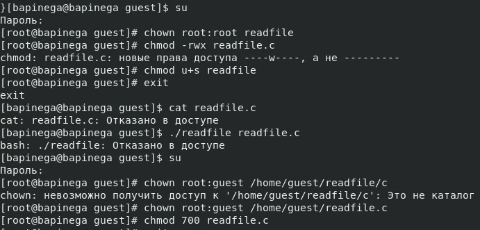
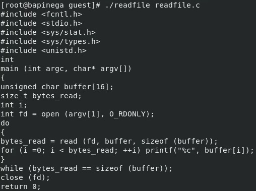
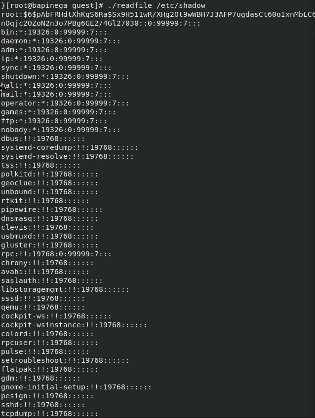

---
## Front matter
lang: ru-RU
title: Лабораторная работа 5
subtitle: Основы информационной безопасности
author:
  - Пинега Б.А.
institute:
  - Российский университет дружбы народов, Москва, Россия

## i18n babel
babel-lang: russian
babel-otherlangs: english

## Formatting pdf
toc: false
toc-title: Содержание
slide_level: 2
aspectratio: 169
section-titles: true
theme: metropolis
header-includes:
 - \metroset{progressbar=frametitle,sectionpage=progressbar,numbering=fraction}
 - '\makeatletter'
 - '\beamer@ignorenonframefalse'
 - '\makeatother'
---

## Докладчик

  * Пинега Белла Александровна
  * Студентка НБИбд-02-22
  * Российский университет дружбы народов
  
## Цель работы
Изучение механизмов изменения идентификаторов, применения
SetUID- и Sticky-битов. Получение практических навыков работы в кон-
соли с дополнительными атрибутами. Рассмотрение работы механизма
смены идентификатора процессов пользователей, а также влияние бита
Sticky на запись и удаление файлов

## Выполнение лабораторной работы
{#fig:001 width=40%}
{#fig:002 width=40%}

## Скомплилирую программу
{#fig:003 width=40%}

## Усложню программу
{#fig:004 width=70%}

## Скомпилирую и запущу 
{#fig:005 width=70%}

## От имени суперпользователя выполню команды
{#fig:006 width=70%}

## Сменю владельца у файла и изменю права 
{#fig:010 width=40%}
{#fig:011 width=40%}

## Программа readfile может прочитать файл /etc/shadow
{#fig:012width=40%}

## Выводы
Я изучила механизмы изменения идентификаторов, применения
SetUID- и Sticky-битов. Получение практических навыков работы в кон-
соли с дополнительными атрибутами. Рассмотрение работы механизма
смены идентификатора процессов пользователей, а также влияние бита
Sticky на запись и удаление файлов
