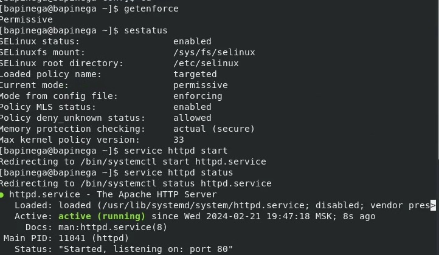
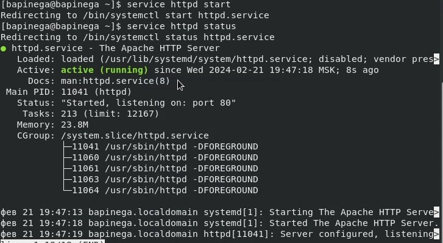
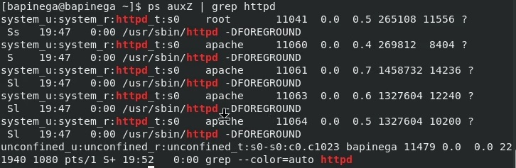
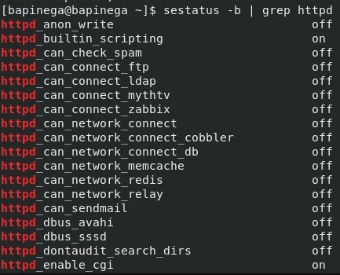
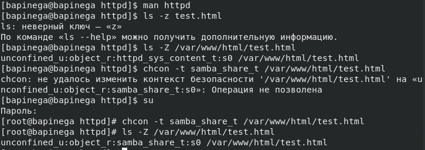
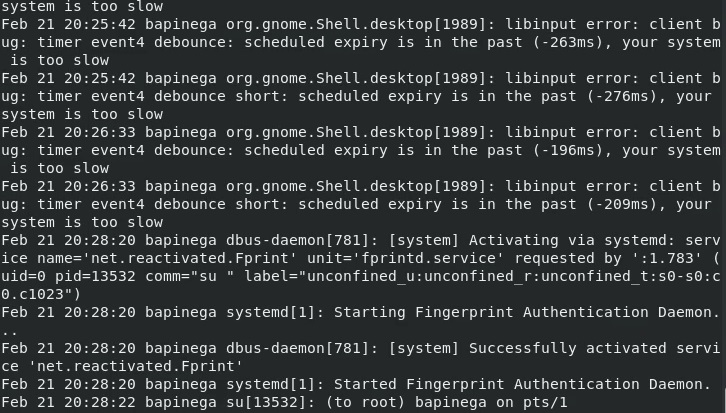
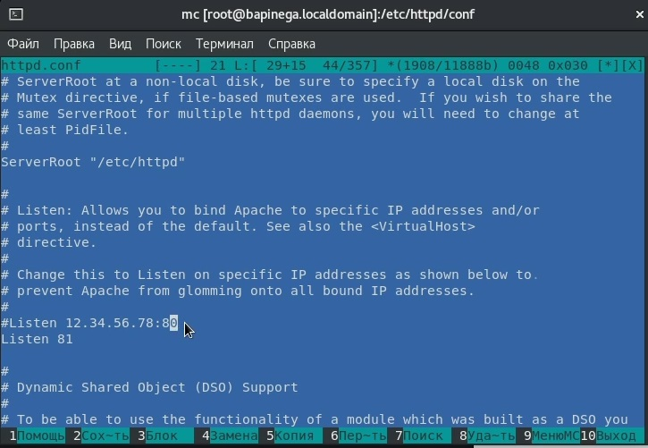
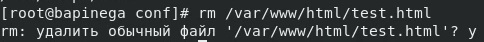

---
## Front matter
lang: ru-RU
title: Лабораторная работа 6
subtitle: Основы информационной безопасности
author:
  - Пинега Б.А.
institute:
  - Российский университет дружбы народов, Москва, Россия

## i18n babel
babel-lang: russian
babel-otherlangs: english

## Formatting pdf
toc: false
toc-title: Содержание
slide_level: 2
aspectratio: 169
section-titles: true
theme: metropolis
header-includes:
 - \metroset{progressbar=frametitle,sectionpage=progressbar,numbering=fraction}
 - '\makeatletter'
 - '\beamer@ignorenonframefalse'
 - '\makeatother'
---

## Докладчик

  * Пинега Белла Александровна
  * Студентка НБИбд-02-22
  * Российский университет дружбы народов
  
## Цель работы
Развить навыки администрирования ОС Linux. Получить первое практическое знакомство с технологией SELinux1.
Проверить работу SELinx на практике совместно с веб-сервером
Apache

## Выполнение лабораторной работы
{#fig:001 width=40%}
{#fig:002 width=40%}

## Найду веб-сервер Apache в списке процессов
{#fig:003 width=50%}

## Текущее состояние переключателей SELinux
{#fig:004 width=40%}

## Для httpd определен контекст 
{#fig:008 width=50%}

## Файл не был отображён
{#fig:009 width=40%}
{#fig:010 width=40%}

## найду строчку Listen 80 и
заменю её на Listen 81
{#fig:011 width=60%}

## Удалю файл 
{#fig:013 width=60%}

## Выводы
Мы развили навыки администрирования ОС Linux. Получили первое практическое знакомство с технологией SELinux1.
Проверить работу SELinx на практике совместно с веб-сервером
Apache
