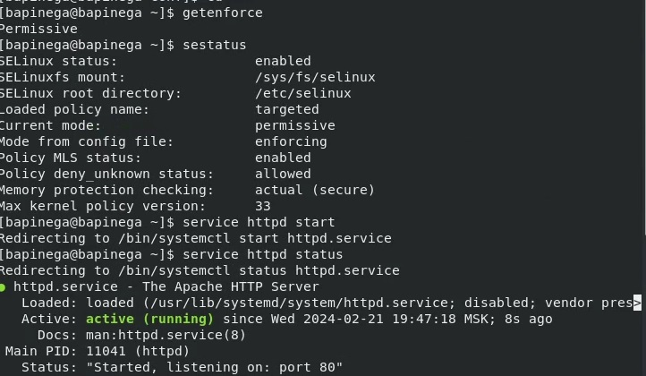
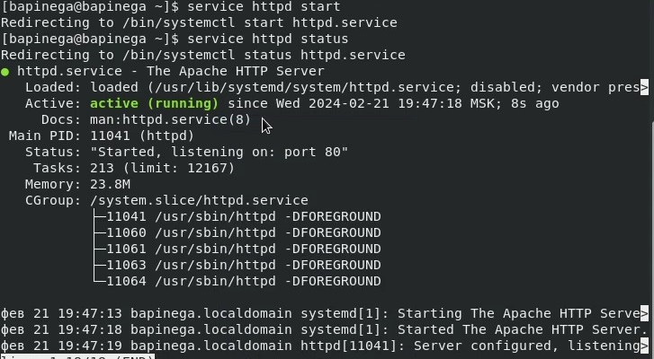
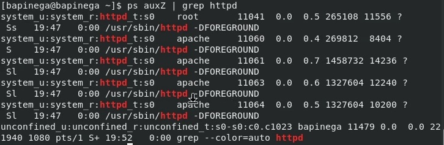
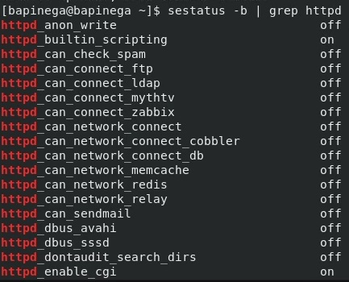
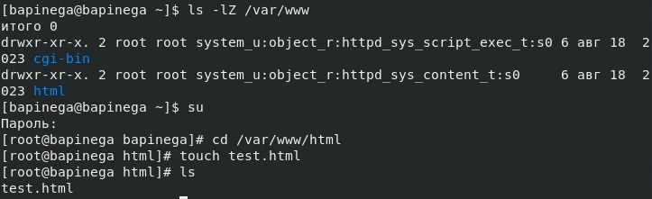
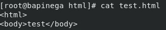
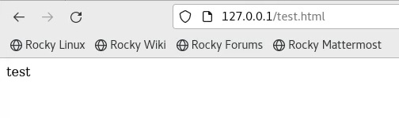
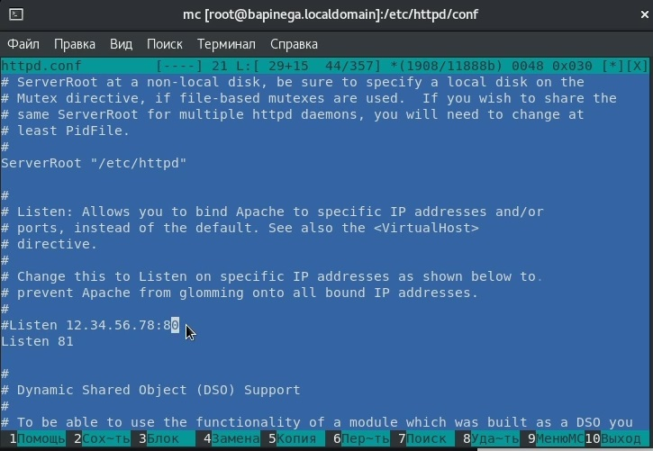
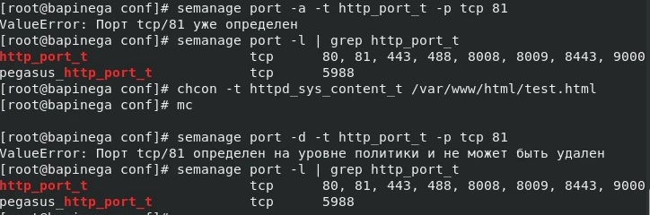

## Front matter
title: "Лабораторная работа №6"
subtitle: "Основы информационной безопасности"
author: "Пинега Белла Александровна"

## Generic otions
lang: ru-RU
toc-title: "Содержание"

## Bibliography
bibliography: bib/cite.bib
csl: pandoc/csl/gost-r-7-0-5-2008-numeric.csl

## Pdf output format
toc: true # Table of contents
toc-depth: 2
lof: true # List of figures
lot: true # List of tables
fontsize: 12pt
linestretch: 1.5
papersize: a4
documentclass: scrreprt
## I18n polyglossia
polyglossia-lang:
  name: russian
  options:
	- spelling=modern
	- babelshorthands=true
polyglossia-otherlangs:
  name: english
## I18n babel
babel-lang: russian
babel-otherlangs: english
## Fonts
mainfont: PT Serif
romanfont: PT Serif
sansfont: PT Sans
monofont: PT Mono
mainfontoptions: Ligatures=TeX
romanfontoptions: Ligatures=TeX
sansfontoptions: Ligatures=TeX,Scale=MatchLowercase
monofontoptions: Scale=MatchLowercase,Scale=0.9
## Biblatex
biblatex: true
biblio-style: "gost-numeric"
biblatexoptions:
  - parentracker=true
  - backend=biber
  - hyperref=auto
  - language=auto
  - autolang=other*
  - citestyle=gost-numeric
## Pandoc-crossref LaTeX customization
figureTitle: "Рис."
tableTitle: "Таблица"
listingTitle: "Листинг"
lofTitle: "Список иллюстраций"
lotTitle: "Список таблиц"
lolTitle: "Листинги"
## Misc options
indent: true
header-includes:
  - \usepackage{indentfirst}
  - \usepackage{float} # keep figures where there are in the text
  - \floatplacement{figure}{H} # keep figures where there are in the text
---

# Цель работы

Развить навыки администрирования ОС Linux. Получить первое практическое знакомство с технологией SELinux1.
Проверить работу SELinx на практике совместно с веб-сервером
Apache

# Задание

Загрузите в дисплейном классе операционную систему Linux. Осуществите
вход в систему. Запустите терминал. Перейдите в каталог /var/tmp:
cd /var/tmp
Создайте каталог с именем пользователя (совпадающий с логином студен-
та в дисплейном классе). Для этого можно использовать команду:
mkdir /var/tmp/`id -un`
или непосредственно:
mkdir /var/tmp/имя_пользователя
Здесь вместо имя_пользователя должен быть указан ваш логин (учётная
запись) в дисплейном классе.
Запустите виртуальную машину, введя в командной строке:
Информационная безопасность компьютерных сетей 11
Рис. 1.6. Окно определения формата виртуального жёсткого диска
Рис. 1.7. Окно определения размера виртуального динамического жёсткого
диска и его расположения
После завершения установки операционной системы корректно переза-
пустите виртуальную машину (рис. 1.18) и при запросе примите условия
лицензии (рис. 1.19–1.20).
Рис. 1.8. Окно «Носители» виртуальной машины: подключение
образа оптического диска
Рис. 1.9. Запуск виртуальной машины
В VirtualBox оптический диск должен отключиться автоматически, но если
это не произошло, то необходимо отключить носитель информации с обра-
зом, выбрав Свойства Носители Rocky-номер-версии.iso Удалить устройство .
Информационная безопасность компьютерных сетей 13
Рис. 1.10. Установка английского языка интерфейса ОС
Войдите в ОС под заданной вами при установке учётной записью. В меню
Устройства виртуальной машины подключите образ диска дополнений госте-
вой ОС (рис. 1.21, 1.22), при необходимости введите пароль пользователя
root вашей виртуальной ОС.
После загрузки дополнений нажмите Return или Enter и корректно переза-
грузите виртуальную машину.
14 Кулябов Д. С., Королькова А. В., Геворкян М. Н.
Рис. 1.11. Окно настройки установки образа ОС
Рис. 1.12. Окно настройки установки: выбор программ
1.3.1. Установка имени пользователя и названия хоста
Если при установке виртуальной машины вы задали имя пользователя или
имя хоста, не удовлетворяющее соглашению об именовании (см. раздел 1.2.2),
то вам необходимо исправить это.
1. Запустите виртуальную машину и залогиньтесь.
2. Запустите терминал и получите полномочия администратора:
su -
Информационная безопасность компьютерных сетей 15
Рис. 1.13. Окно настройки установки: отключение KDUMP
Рис. 1.14. Окно настройки установки: место установки
3. Создайте пользователя (вместо username укажите ваш логин в дисплей-
ном классе):
adduser -G wheel username
4. Задайте пароль для пользователя (вместо username укажите ваш логин
в дисплейном классе):
passwd username
16 Кулябов Д. С., Королькова А. В., Геворкян М. Н.
Рис. 1.15. Окно настройки установки: сеть и имя узла
Рис. 1.16. Установка пароля для root
5. Установите имя хоста (вместо username укажите ваш логин в дисплейном
классе):
hostnamectl set-hostname username
6. Проверьте, что имя хоста установлено верно:
hostnamectl
Информационная безопасность компьютерных сетей 17
Рис. 1.17. Установка пароля для пользователя с правами администратора
Рис. 1.18. Завершение установки ОС
1.4. Домашнее задание
Дождитесь загрузки графического окружения и откройте терминал. В окне
терминала проанализируйте последовательность загрузки системы, выпол-
нив команду dmesg. Можно просто просмотреть вывод этой команды:
18 Кулябов Д. С., Королькова А. В., Геворкян М. Н.
Рис. 1.19. Первоначальная настройка ОС: переход к лицензии
Рис. 1.20. Первоначальная настройка ОС: лицензия
dmesg | less
Информационная безопасность компьютерных сетей 19
Рис. 1.21. Подключение образа диска дополнений гостевой ОС
Рис. 1.22. Запуск образа диска дополнений гостевой ОС
Можно использовать поиск с помощью grep:
dmesg | grep -i "то, что ищем"
Получите следующую информацию.
1. Версия ядра Linux (Linux version).
2. Частота процессора (Detected Mhz processor).
3. Модель процессора (CPU0).
4. Объем доступной оперативной памяти (Memory available).
5. Тип обнаруженного гипервизора (Hypervisor detected).
6. Тип файловой системы корневого раздела.
20 Кулябов Д. С., Королькова А. В., Геворкян М. Н.
7. Последовательность монтирования файловых систем
# Теоретическое введение

1.2.1. Техническое обеспечение
Лабораторная работа подразумевает установку на виртуальную машину
VirtualBox (https://www.virtualbox.org/) операционной системы Linux
(дистрибутив Rocky (https://rockylinux.org/)).
Выполнение работы возможно как в дисплейном классе факультета
физико-математических и естественных наук РУДН, так и дома. Описание
выполнения работы приведено для дисплейного класса со следующими ха-
рактеристиками:
– Intel Core i3-550 3.2 GHz, 4 GB оперативной памяти, 20 GB свободного
места на жёстком диске;
– ОС Linux Gentoo (http://www.gentoo.ru/);
– VirtualBox верс. 6.1 или старше;
– каталог с образами ОС для работающих в дисплейном классе:
/afs/dk.sci.pfu.edu.ru/common/files/iso/.
1.2.2. Соглашения об именовании
При выполнении работ следует придерживаться следующих правил име-
нования: имя виртуальной машины, имя хоста вашей виртуальной машины,
пользователь внутри виртуальной машины должны совпадать с логином
студента, выполняющего лабораторную работу. Вы можете посмотреть
ваш логин, набрав в терминале ОС типа Linux команду id -un.

# Выполнение лабораторной работы
1. Проверю, что SELinux работает в режиме enforcing политики targeted с помощью ко-
манд getenforce и sestatus. Обращусь с помощью браузера к веб-серверу, запущенному на компьютере, он не работал - запустила.
{#fig:001 width=70%}
{#fig:002 width=70%}
3. Найду веб-сервер Apache в списке процессов, его контекст
безопасности 
{#fig:003 width=70%}
4. Текущее состояние переключателей SELinux для Apach
{#fig:004 width=70%}
5. Тип файлов и поддиректорий, находящихся в директории
/var/www и /var/www/html
{#fig:005 width=70%}
Создам от имени суперпользователя html-файл /var/www/html/test.html следующего содержания:
{#fig:006 width=70%}
Успешно
6. Файл успешно отображен
{#fig:007 width=70%}
7. Для httpd определен контекст файла httpd_sys_content_t
{#fig:008 width=70%}
Изменю контекст файла /var/www/html/test.html с
httpd_sys_content_t на samba_share_t:
Успешно
8. Файл не был отображён, тк запущены процессы setroubleshootd и audtd. Смотрю системный лог-файл:
{#fig:009 width=70%}
{#fig:010 width=70%}
9. В файле /etc/httpd/httpd.conf найду строчку Listen 80 и
заменю её на Listen 81
{#fig:011 width=70%}
10. Сбой не происходит, тк порт 81 определен на уровне политики.
{#fig:012width=70%}
Исправьте обратно конфигурационный файл apache, вернув Listen 80.
Удалю привязку http_port_t к 81 порту
12. Удалю файл /var/www/html/test.html:
{#fig:013 width=70%}

# Выводы
Мы развили навыки администрирования ОС Linux. Получили первое практическое знакомство с технологией SELinux1.
Проверить работу SELinx на практике совместно с веб-сервером
Apache

# Список литературы{.unnumbered}

::: {#refs}
:::
