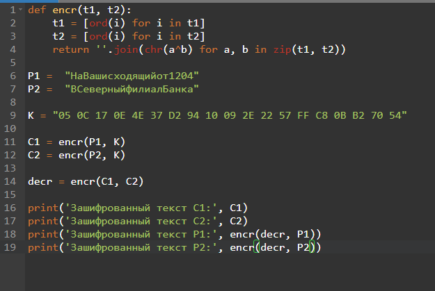
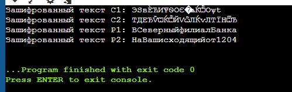

---
## Front matter
lang: ru-RU
title: Лабораторная работа 8
subtitle: Основы информационной безопасности
author:
  - Пинега Б.А.
institute:
  - Российский университет дружбы народов, Москва, Россия

## i18n babel
babel-lang: russian
babel-otherlangs: english

## Formatting pdf
toc: false
toc-title: Содержание
slide_level: 2
aspectratio: 169
section-titles: true
theme: metropolis
header-includes:
 - \metroset{progressbar=frametitle,sectionpage=progressbar,numbering=fraction}
 - '\makeatletter'
 - '\beamer@ignorenonframefalse'
 - '\makeatother'
---

## Докладчик

  * Пинега Белла Александровна
  * Студентка НБИбд-02-22
  * Российский университет дружбы народов

## Цель
Освоить на практике применение режима однократного гаммирования
на примере кодирования различных исходных текстов одним ключом

## Код программы:
{#fig:001 width=70%}

## Результат
{#fig:002 width=70%}

## Выводы
Я освоила на практике применение режима однократного гаммирования
на примере кодирования различных исходных текстов одним ключом

