---
## Front matter
lang: ru-RU
title: Индивидуальный проект 3
subtitle: Основы информационной безопасности
author:
  - Пинега Б.А.
institute:
  - Российский университет дружбы народов, Москва, Россия

## i18n babel
babel-lang: russian
babel-otherlangs: english

## Formatting pdf
toc: false
toc-title: Содержание
slide_level: 2
aspectratio: 169
section-titles: true
theme: metropolis
header-includes:
 - \metroset{progressbar=frametitle,sectionpage=progressbar,numbering=fraction}
 - '\makeatletter'
 - '\beamer@ignorenonframefalse'
 - '\makeatother'
---

## Докладчик

  * Пинега Белла Александровна
  * Студентка НБИбд-02-22
  * Российский университет дружбы народов

:::
::::::::::::::

## Цель работы
Научиться основным способам тестирования веб приложений

## Переберем пароль конкретного пользователя
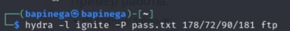{#fig:001 width=70%}

## Переберу имя пользователя по паролю
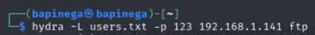{#fig:003 width=70%}

## Сохраним выходные данные
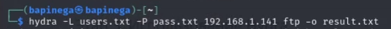{#fig:006 width=40%}
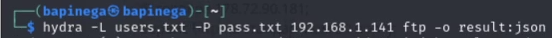{#fig:007 width=40%} 

## Возобновление атаки брутфорс
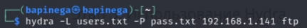{#fig:008 width=40%}
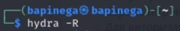{#fig:009 width=40%}

## Сгенерирую пароли с различным набором символов
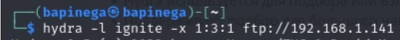{#fig:010 width=70%}

## Для лучшего понимания можно просмотреть результаты командой
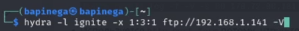{#fig:011 width=40%}
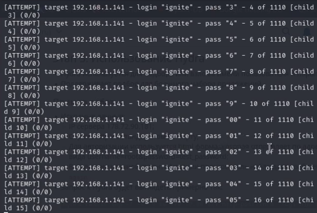{#fig:012 width=40%}

## Атака определенного порта, а не порта по умолчанию
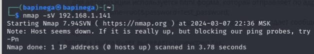{#fig:013 width=40%}
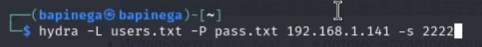{#fig:014 width=40%}

## Выводы
Я научилась пользоваться Hydra.

::: 

