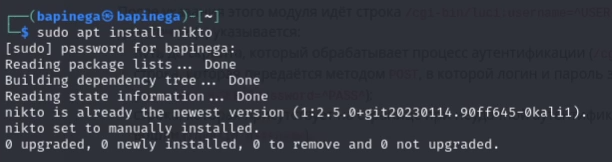
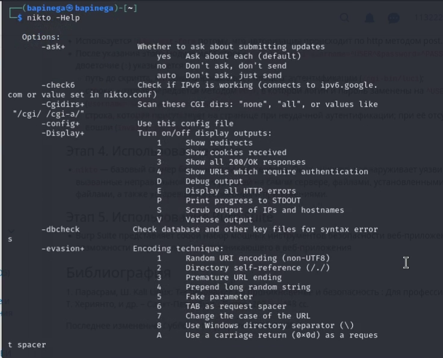
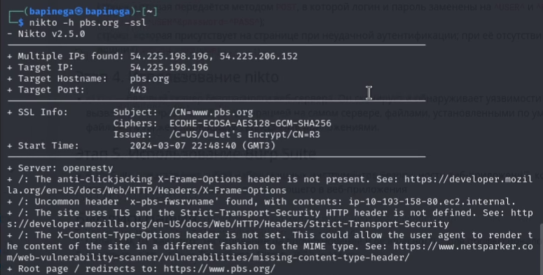
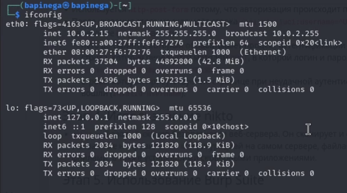
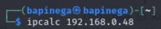

---
## Front matter
lang: ru-RU
title: Индивидуальный проект 4
subtitle: Основы информационной безопасности
author:
  - Пинега Б.А.
institute:
  - Российский университет дружбы народов, Москва, Россия

## i18n babel
babel-lang: russian
babel-otherlangs: english

## Formatting pdf
toc: false
toc-title: Содержание
slide_level: 2
aspectratio: 169
section-titles: true
theme: metropolis
header-includes:
 - \metroset{progressbar=frametitle,sectionpage=progressbar,numbering=fraction}
 - '\makeatletter'
 - '\beamer@ignorenonframefalse'
 - '\makeatother'
---

## Докладчик

  * Пинега Белла Александровна
  * Студентка НБИбд-02-22
  * Российский университет дружбы народов

:::
::::::::::::::

## Цель работы
Научиться основным способам тестирования веб приложений

## Установлю nikto
{#fig:001 width=70%}

## Познакомлюсь с nikto 
{#fig:002 width=70%}

##  Выполню сканирование SSL и порта 443
{#fig:003 width=70%} 

##  Сканирую ip-адрес
{#fig:004 width=40%}
{#fig:005 width=40%}

## Выводы
Я познакомилась с nikto

::: 

